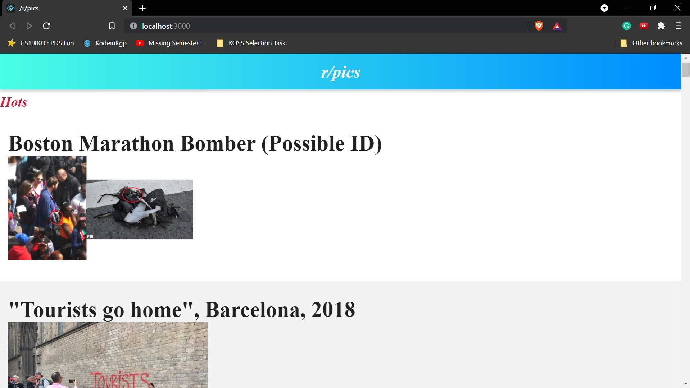
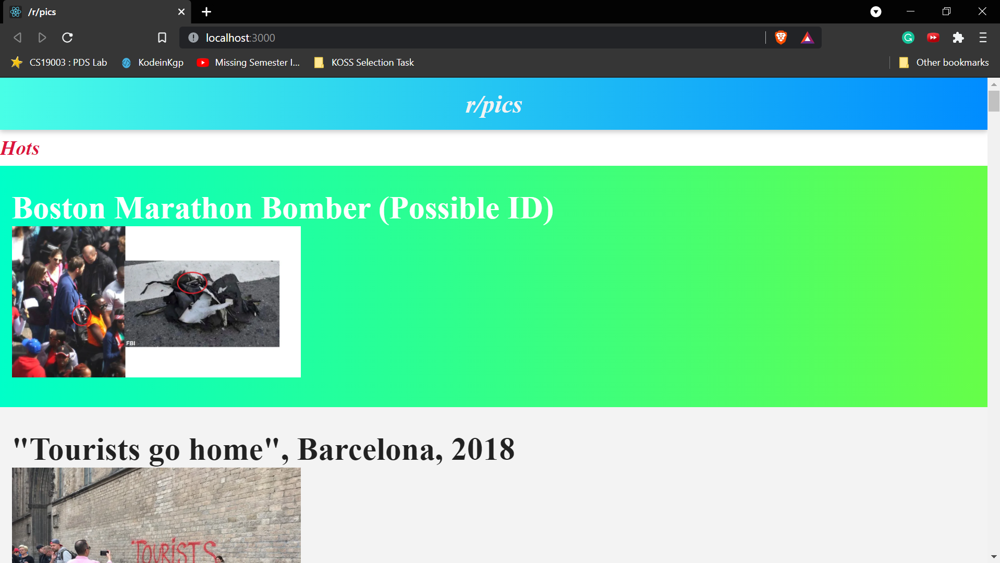
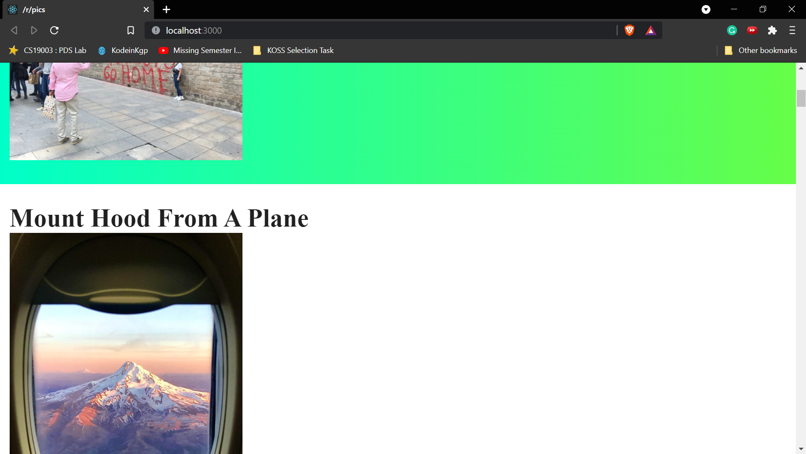

# **KOSS TASK**

## Create reddit_gallery
## The task was to build a frontend only app to view images from the subreddit -> r/pics

* So first thing which comes in our mind is :_**What is subreddit**_?

* Before understanding subreddit we should know about _**Reddit**_

* Reddit is a network of communities based on people's interests, there is a community for almost everyone, find the community in which you're interested and become part of it

* And a _**subreddit**_ is a forum dedicated to a specific topic on _**Reddit**_

## Tools Used:

### React:
* It is an open-source front-end JavaScript library for building _**user interfaces or UI**_ components.
* It is maintained by **Facebook** and a community of individual developers and companies.

### JSON:
* JSON stands for the JavaScript Object Notation 
* It is a lightweight format for storing and transporting data

### npm:
* It is a package manager for the JavaScript programming language
* npm is the world's largest Software Registry.
* Open-source developers use npm to share software.
* Many organizations also use npm to manage private development.

### npx:
* used it in cmd to create react app by running -> npx create-react-app reddit-gallery

### HTML and CSS

## The Process: 
* As I have never before created an app and in the task information it was given that javascript or a similar language that can run in browser universally can be used so I went on google and searched how to create apps using js

* One more reason for using _**JavaScript**_ was that material given to me was in _**json**_ file format so if I use any other language then I'll have to convert from json format to the format of objects of that language, though there are libraries available for that like _**GSON**_, _**JACKSON**_ but it will be easier to use JavaScript itself

* And then I read some articles and saw some YouTube videos of how to create simple apps using React

* And while doing that I realised that React is bit different from the languages which I know(C, Python) 

* So I started reading React tutorials from W3schools.com [here is the link](https://www.w3schools.com/react/)

* And while doing that I had to read about :

* how to import and export libraries and script in javascript

* using the render function : ReactDOM.render() function, the purpose of the function is to display the specified HTML code inside the specified HTML element

* JavaScript functions : a block of code designed to perform a particular task

* Javascript arrays 

* use of fetch() to fetch the data from the server, in my case the [link](https://www.reddit.com/r/pics.json) given in the Materials section of the task

* And then finally started to code, but before that creating app using react for that

* open command prompt
* type npx create-react-app reddit-gallery
* after sometime the folder will be created with the name "reddit-gallery" 
* though this process will take some time as libraries like react, react-dom and react-scripts with cra-template gets installed
* after that type -> cd reddit-gallery/
* also type -> npm start 
* so that npm can begin the process to make a development server available for our React application

* open the text editor and delete unnecessary files like App.css, App.test.js, logo.svg

* __*Finally started to code*__

* in the file App.js under the folder src created a function named App and then started what this will return , so I created a header with a paragraph tag
and also added a heading with h4 tag
and enclosed it in a div giving classes wherever it was required

* imported useState and useEffect
* then created a constant and an empty array 
* __*basically what I was trying that my function should take input from the server about the information of articles in the subreddit r/pics*__

* and for this purpose of the app I created a folder inside src which contained the file Articles.js

* __*Articles.js basically publishes heading of articles as an h3 tag and img associated with that article and when we click on the heading of the article, they open on original reddit website as the value of target in the anchor tag is set to '_blank'*__

* Edited index.css to style and beautify everything so that **_Ayush likes the app_**

## *This is how the app looks*

### Hovering to an article :

